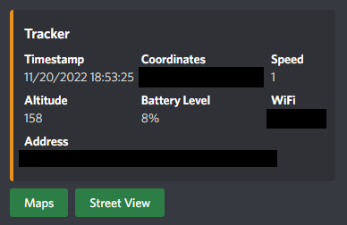

# Othersight.py

A discord bot that uses [Overland IOS](https://github.com/aaronpk/Overland-iOS) to send constant tracking information to a Discord channel. Operational security at its finest.

## Functionality
- Get location from a phone and send it to a Discord server
- Resolves the address of the provided coordinates
- Shows other information such as altitude, battery level, speed, and WiFi
- Can generate static Google maps images as well as static streetview images

## Example
